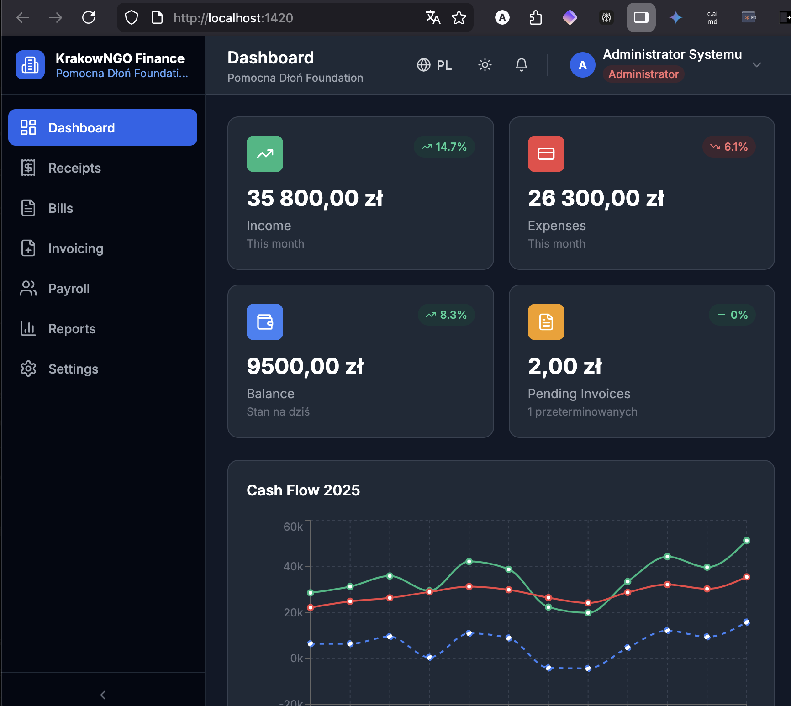
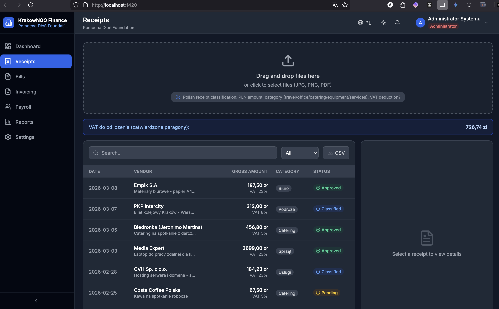
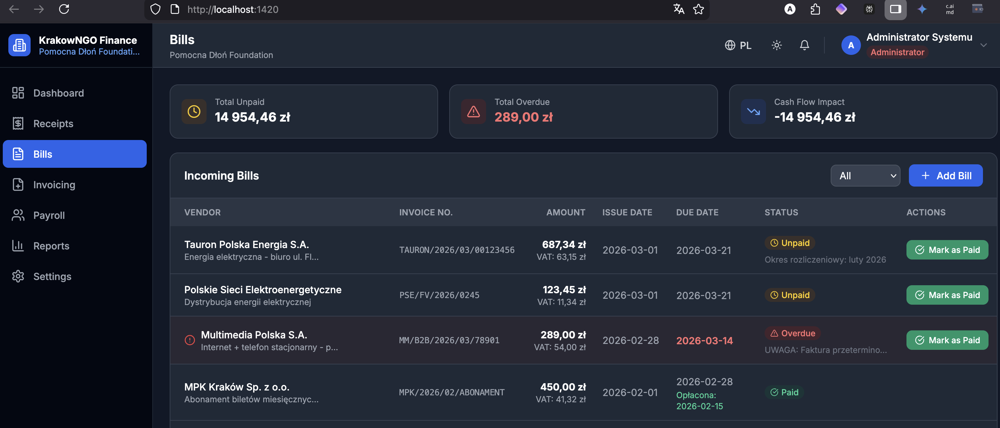
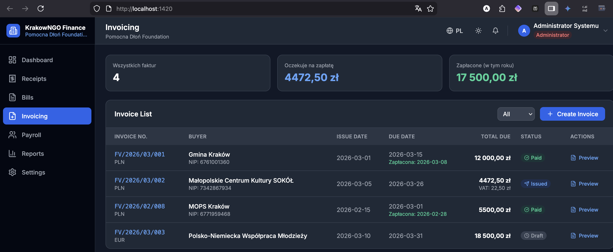
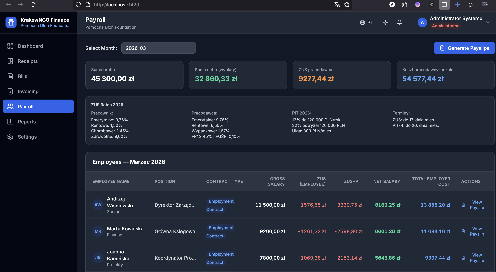
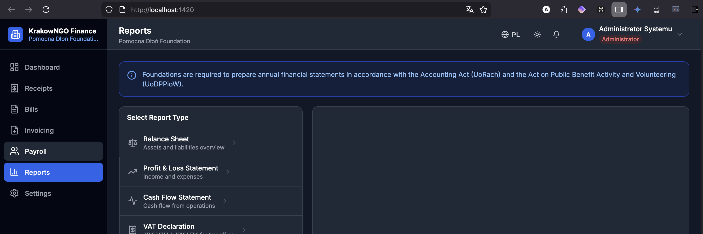
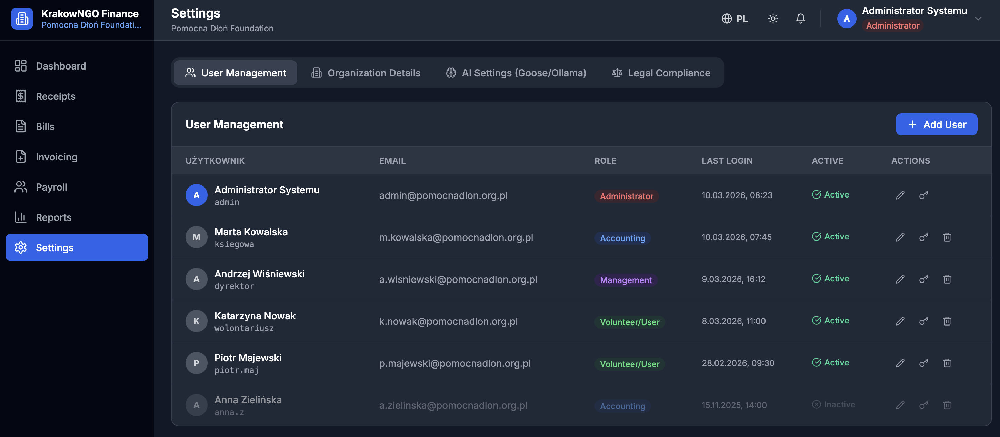

# KrakowNGO Finanse

> Cross-platform desktop accounting application for Polish non-profit organizations. Built on Tauri (Rust + SQLite backend) + React/TypeScript frontend. Designed specifically for the accounting and legal compliance requirements of Polish NGOs (*fundacje* and *stowarzyszenia*).

**Status: v0.4.0 — pre-beta.** Full Rust/SQLite backend written and registered. All frontend modules wired to `invoke()`. Browser dev mode runs with full in-memory mock fallback (`npm run dev`). Desktop mode requires Rust toolchain (see [Running as a Desktop App](#running-as-a-desktop-app)).

---

## Features

### Modules

| Module | Polish Name | Status |
|--------|-------------|--------|
| Dashboard | Panel główny | ✅ Live — KPI cards, charts, transactions |
| Receipts | Paragony | ✅ Live — drag-drop, OCR panel, AI classification, approve/reject |
| Bills | Faktury kosztowe | ✅ Live — overdue tracking, mark paid, add bills |
| Invoicing | Fakturowanie | ✅ Live — Polish VAT format, NIP/KRS/REGON, KSeF-ready |
| Payroll | Kadry i płace | ✅ Live — 2026 ZUS+PIT rates, payslip generator |
| Reports | Raporty | ✅ Live — 6 report types, CSV export, PDF via print dialog |
| Settings | Ustawienia | ✅ Live — user CRUD, org details, Ollama AI config |
| Legal Compliance | Zgodność Prawna | ✅ Live — change feed, urgency badges, dismiss/apply |

### What works right now (browser dev mode)

- **Full interactive UI** — every form, modal, and button functional
- **Role-based access control** — 4 roles: Admin, Księgowość, Zarząd, Wolontariusz
- **Live payroll calculation** — 2026 ZUS/PIT rates applied per employee
- **Legal change warning system** — polls a GitHub-hosted feed, shows badge counts and urgency timelines
- **Real CSV export** — generates downloadable `.csv` with UTF-8 BOM (Excel-compatible, Polish diacritics preserved)
- **PDF export** — `window.print()` → OS print dialog (Save as PDF on macOS/Windows)
- **User management** — create, edit, soft-delete users; reset passwords
- **Dark mode** + **PL/EN i18n** — system default detection, persistent

### What requires the Rust backend (desktop mode only)

- SQLite persistence across sessions
- Real bcrypt password auth
- File system access (receipt uploads, log files)
- Tesseract OCR pipeline *(planned)*
- Ollama AI classification *(planned)*

---

## Screenshots

| | |
|---|---|
|  |  |
| **Dashboard** — KPI cards, cash flow chart, transactions | **Receipts** — drag-drop upload, OCR panel, AI classification |
|  |  |
| **Bills** — overdue tracking, mark paid, cash flow summary | **Invoicing** — Polish VAT format, NIP/KRS/REGON, KSeF-ready |
|  |  |
| **Payroll** — 2026 ZUS+PIT rates, payslip generator | **Reports** — 6 report types, CSV export, PDF print |
|  | |
| **Settings** — user CRUD, roles, org details, Ollama config | |

---

## Tech Stack

| Layer | Technology |
|-------|-----------|
| Desktop framework | Tauri v1 (Rust) |
| Database | SQLite via `rusqlite` (bundled — no external install) |
| Auth | bcrypt password hashing |
| Frontend | React 18 + TypeScript + Vite 5 |
| Styling | Tailwind CSS v3 (dark mode: `class`) |
| i18n | i18next + react-i18next (Polish + English) |
| Charts | Recharts |
| Icons | Lucide React |
| HTTP (legal feed) | reqwest (blocking) |
| AI (planned) | Ollama + DeepSeek-R1 (local, offline) |

---

## Quick Start (Browser / Dev Mode)

No Rust required. Runs entirely in-browser with mock data.

```bash
git clone https://github.com/autisticcaveman/krakow-ngo-accounting
cd krakow-ngo-accounting
npm install
npm run dev
```

Open **http://localhost:1420**

### Demo Accounts

| Username | Password | Role | Access |
|----------|----------|------|--------|
| `admin` | `admin` | Administrator | Full access — all modules + Settings + Logs |
| `ksiegowa` | `pass` | Księgowość | Receipts, Bills, Invoicing, Payroll, Reports |
| `dyrektor` | `pass` | Zarząd | Reports only |
| `wolontariusz` | `pass` | Użytkownik | Submit receipts only |

Click any demo account row on the login page to auto-fill credentials.

---

## Running as a Desktop App

Requires Rust and Tauri CLI. Use the bundled install script:

```bash
./install.sh
```

This checks for and installs:
- Node.js ≥ 18
- Rust (via rustup)
- Tauri CLI (`cargo install tauri-cli`)
- npm dependencies
- Runs a build verification

Then:

```bash
npm run tauri dev     # development (hot reload)
npm run tauri build   # production .app / .exe / .deb
```

First `cargo` compile takes 5–15 minutes while it builds all Rust dependencies. Subsequent builds are fast.

On first login with `admin`/`admin` in desktop mode, a prompt will require changing the default password before proceeding.

---

## Polish Legal Compliance

The app is built around the specific compliance requirements for Polish non-profits:

| Requirement | Coverage |
|-------------|----------|
| Double-entry bookkeeping | Schema + reporting structure |
| VAT rates: 23%, 8%, 5%, ZW | Receipt + invoice classification |
| ZUS składki (2026 rates) | Live payroll calculation |
| PIT advance tax (2026) | Live payroll calculation, ulga podatkowa |
| JPK_V7M structure | Deklaracja VAT report preview |
| KSeF e-invoicing mandate | Invoicing module, KSeF export button (2026/2027 phases tracked) |
| Annual reporting (UoRach art. 45) | Sprawozdanie Roczne report |
| DPPioW art. 23 | Sprawozdanie Roczne report |

### Legal Change Warning System

A GitHub-hosted `legal-updates.json` feed is polled daily. Upcoming legal changes (ZUS rate changes, KSeF mandate phases, JPK schema updates) trigger:

- **> 90 days** — silent
- **30–90 days** — yellow badge in header + yellow card in Settings
- **< 30 days** — red persistent badge + red card
- **Past effective date, unapplied** — hard modal warning on next login

---

## Backend Architecture

### SQLite Schema (10 tables)

```
users, organization, receipts, bills, invoices, invoice_items,
employees, payslips, app_settings, legal_updates_dismissed
```

WAL mode enabled. Foreign keys enforced. Schema migration runs on first launch, seeding default org and admin user.

### Tauri Commands (28 registered)

| Module | Commands |
|--------|----------|
| Auth | `login`, `get_users`, `create_user`, `update_user`, `reset_password` |
| Receipts | `get_receipts`, `upsert_receipt`, `update_receipt_status`, `delete_receipt` |
| Bills | `get_bills`, `upsert_bill`, `mark_bill_paid`, `delete_bill` |
| Invoices | `get_invoices`, `save_invoice`, `mark_invoice_paid`, `delete_invoice` |
| Employees | `get_employees`, `upsert_employee`, `delete_employee` |
| Payroll | `get_payslips`, `generate_payslip`, `calc_payslip` |
| Settings | `get_organization`, `save_organization`, `get_setting`, `set_setting` |
| Legal | `get_legal_updates`, `dismiss_legal_update`, `apply_legal_update` |
| Dashboard | `get_dashboard_data` |

### invoke() Bridge

`src/lib/invoke.ts` detects `window.__TAURI__` at runtime:
- **Desktop**: routes to real Tauri `invoke()` → Rust backend → SQLite
- **Browser**: routes to `mockInvoke()` → in-memory state (resets on refresh)

`npm run dev` always works. No Rust required for UI development.

---

## Project Structure

```
krakow-ngo-accounting/
├── src/
│   ├── App.tsx                        — Root with providers
│   ├── lib/invoke.ts                  — Tauri/mock bridge
│   ├── contexts/
│   │   ├── AuthContext.tsx            — Auth state, session management
│   │   ├── ThemeContext.tsx           — Dark/light + system detection
│   │   └── LegalUpdatesContext.tsx    — Legal feed polling, urgentCount
│   ├── components/
│   │   ├── Auth/
│   │   │   ├── LoginPage.tsx          — Login + demo quick-fill
│   │   │   └── ChangePasswordModal.tsx — First-run admin password prompt
│   │   └── Layout/
│   │       ├── AppShell.tsx           — Layout shell + module routing
│   │       ├── Sidebar.tsx            — Collapsible, role-filtered nav
│   │       └── Header.tsx             — Legal bell badge, theme, lang, user menu
│   ├── modules/
│   │   ├── Dashboard/DashboardModule.tsx
│   │   ├── Receipts/ReceiptsModule.tsx
│   │   ├── Bills/BillsModule.tsx
│   │   ├── Invoicing/InvoicingModule.tsx
│   │   ├── Payroll/PayrollModule.tsx
│   │   ├── Reports/ReportsModule.tsx
│   │   └── Settings/SettingsModule.tsx
│   ├── types/index.ts                 — All TypeScript interfaces
│   ├── data/mockData.ts               — Realistic Polish mock data
│   └── i18n/locales/{pl,en}.json     — ~200 translation keys each
├── src-tauri/
│   ├── src/
│   │   ├── main.rs                    — Tauri builder + 28 command handlers
│   │   ├── db.rs                      — SQLite init, migrations, seed
│   │   ├── models.rs                  — Rust structs for all domain types
│   │   └── commands/
│   │       ├── auth.rs, receipts.rs, bills.rs, invoices.rs
│   │       ├── employees.rs, payroll.rs, settings.rs
│   │       ├── legal.rs, dashboard.rs
│   │       └── mod.rs
│   ├── Cargo.toml                     — Full dependency set
│   ├── build.rs                       — tauri_build::build()
│   └── tauri.conf.json                — Window config, allowlist
├── public/legal-updates.json          — Bundled legal change feed
└── install.sh                         — Prereq checker + installer
```

---

## Mock Organization

```
Fundacja Pomocna Dłoń
NIP:    676-123-45-67
KRS:    0000123456
REGON:  123456789
ul. Floriańska 15/3, 31-019 Kraków
```

Mock data includes 6 employees, receipts from Polish vendors (Empik, PKP, Biedronka, OVH), bills from Tauron/ZUS/MPK/US, and invoices from Gmina Kraków/MOPS.

---

## Roadmap

### Next (v0.5.x)
- Legal compliance alert card on Dashboard
- Employee management dedicated entry point (currently inside Payroll)
- Category management UI — custom receipt/payment categories (currently hardcoded)
- Expenses by employee report

### v0.6.x
- IT Admin role + Logs module (application logs 30-day rotation, audit logs 90-day rotation)

### Medium term
- Tesseract OCR (Polish + English) for receipt processing
- Ollama DeepSeek-R1 AI classification for receipts
- KSeF XML export with UPO token flow
- ZUS e-Deklaracje XML export
- JPK_V7M monthly VAT export
- SMB sync for multi-machine SQLite access

---

*Built for Fundacja Pomocna Dłoń, Kraków. Not for production use in current state.*
